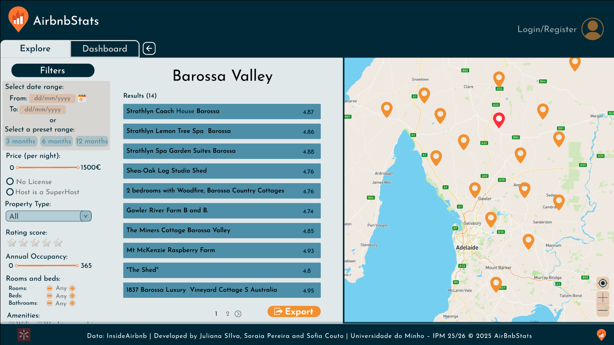
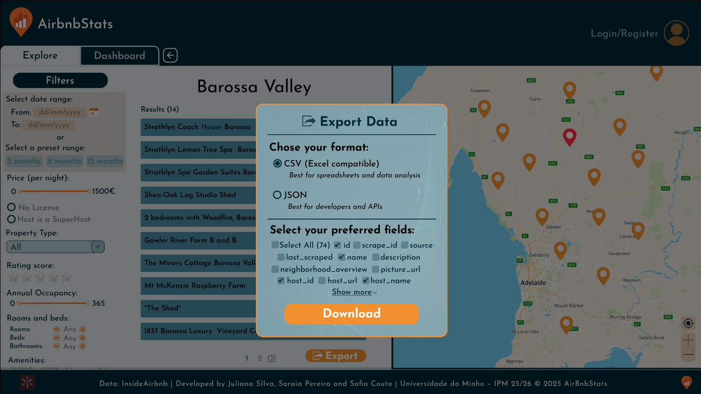
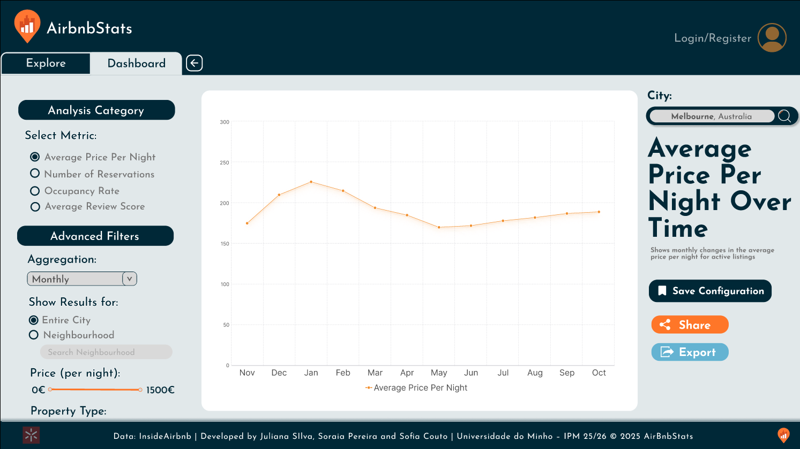
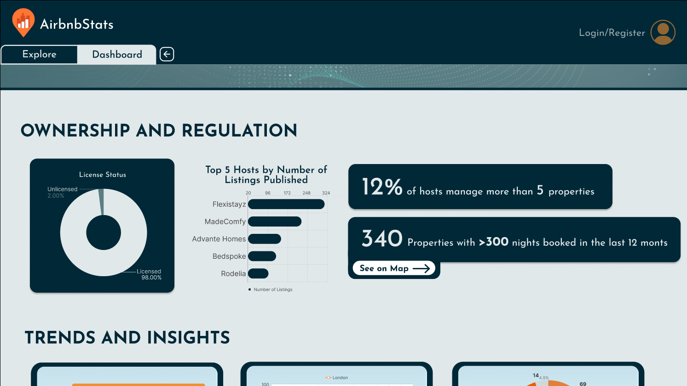
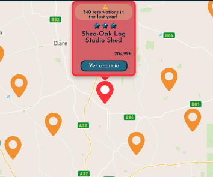
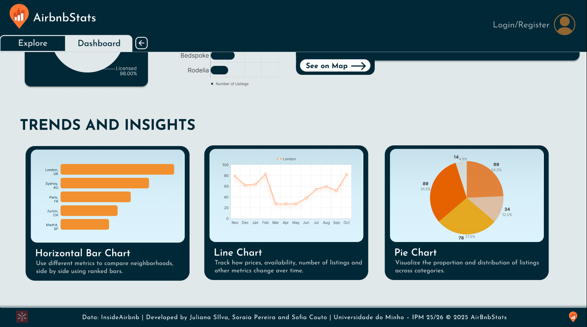
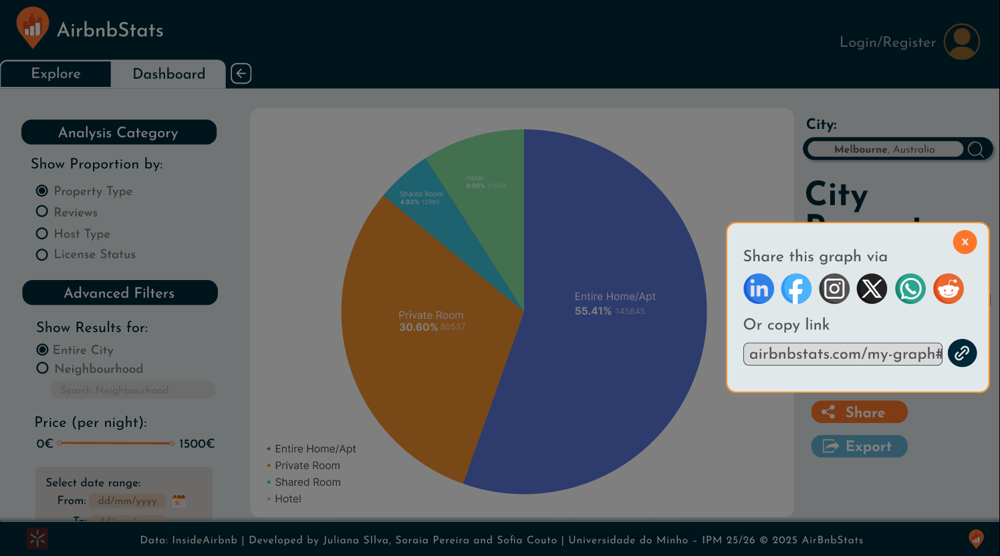
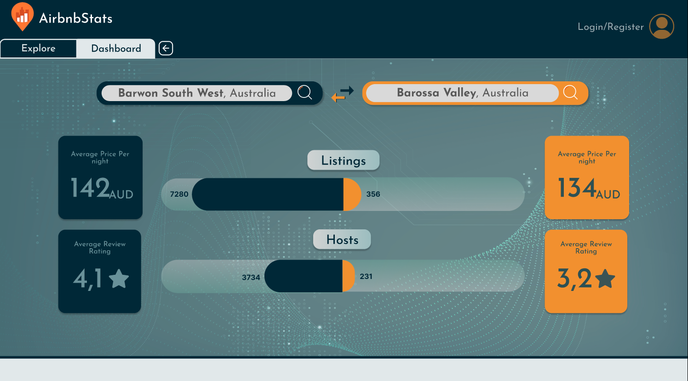
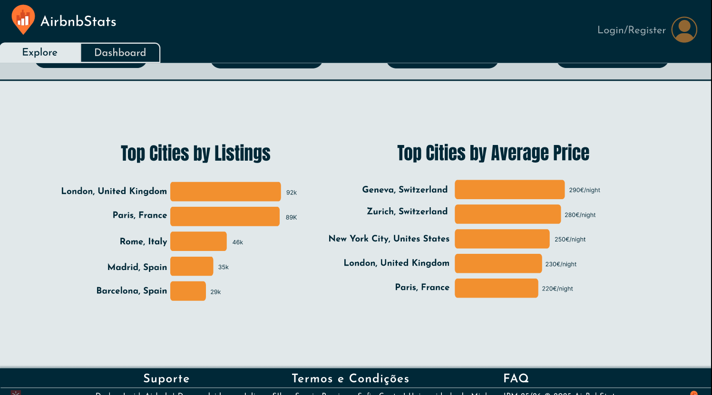

# Trabalho Prático – Fase I

## 1. Introdução
No âmbito deste trabalho prático, foi prototipada a interface AirbnbStats, que permite visualizar dados da plataforma InsideAirbnb sobre listagens, preços e ocupação, permitindo que investigadores, gestores públicos e ativistas tenham acesso à informação necessária para análise do impacto do Airbnb em diferentes cidades de forma rápida e intuitiva. O protótipo desenvolvido através da plataforma Figma pode ser acedido através dos seguintes links: 

- https://www.figma.com/design/n7wOA0VAQSEzCumZla0rty/Airbnb?node-id=0-1&t=pW1aq6Go3Uv8tUXV-1 (*Design*)
- https://www.figma.com/proto/n7wOA0VAQSEzCumZla0rty/Airbnb?node-id=0-1&t=o3zMh9IpxWB4gcue-1 (*Apresentação*)

## 2. Avaliação Heurística
Para avaliar a interface desenvolvida, foram utilizadas Heurísticas de Nielson. Durante este processo foram encontradas dificuldades, que foram eventualmente corrigidas. Nesta secção estão detalhadas as soluções encontradas para seguir os melhores princípios de usabilidade. 

### 2.1 Visibilidade do Estado do Sistema

São mostradas mensagens de erro na página de login quando o email não é reconhecido (User not found. Please sign up first) e quando não é possível fazer login por falta de informação - Campo de email ou password vazio - ou password errada (Invalid credentials). Para além disso, o utilizador também reconhece quando o login é efetuado com sucesso, uma vez que, para além de ser reencaminhado para a página principal, fica visível o seu nome de utilizador onde antes se clicava para efetuar login.
Na página de registo de novos utilizadores há mensagens de erro caso já exista um utilizador registado com o mesmo email (This email address is already in use) ou caso algum dos campos esteja vazio (Email, password and username required). Ao efetuar o seu registo com sucesso, o utilizador é reencaminhado para a página de login onde aparece uma mensagem de sucesso. 
Em toda a área da dashboard há uma mensagem de erro quando o campo de pesquisa da cidade estiver vazio (Please select a city).
Na página de contacto ao suporte, aparece uma mensagem de sucesso quando se envia email (Email sent successfully). 
Nas páginas de criação e personalização de gráficos, ao guardar uma configuração aparece uma mensagem de sucesso caso o utilizador esteja logado, caso contrário é reencaminhado para a página de login com a indicação de que só é possível guardar caso tenha uma conta.

### 2.2 Correspondência entre o Sistema e o Mundo Real

A interface utiliza termos usados no vocabulário do quotidiano dos utilizadores, como “host” (anfitrião), “Occupancy rate” (taxa de ocupação) ou “Average price per night” (preço médio por noite). Evitam-se expressões demasiado técnicas e, quando necessário, são usados ícones ou breves descrições para clarificar o significado, como na página de comparação de cidades onde existem ícones de informação sobre o gráfico. 
Os controlos e interações seguem convenções familiares, como filtros com caixas de seleção e menus suspensos, mapas interativos e dashboards semelhantes a ferramentas conhecidas (como Power BI ou Tableau). Além disso, os ícones (por exemplo, casa, mapa, gráfico) representam conceitos reconhecíveis, tornando a navegação mais intuitiva e próxima da experiência real dos utilizadores.

### 2.3 Controlo e Liberdade do Utilizador

A interface inclui botões visíveis de “voltar”, permitindo regressar facilmente à página anterior sem perder o contexto.  Em ações mais simples (como aplicar ou remover filtros), é possível reverter a última operação de forma rápida, clicando só nos filtros que se quer aplicar ou remover, sendo ainda possível reiniciar os filtros de uma maneira simples através do botão “Reset Filters”.

### 2.4 Consistência e Normas

 O design segue as convenções visuais e de interação mais comuns em plataformas de visualização de dados e aplicações web modernas. A estrutura de navegação, os ícones e os padrões de filtragem e pesquisa são semelhantes a ferramentas amplamente utilizadas, o que reduz a curva de aprendizagem e aumenta a familiaridade dos utilizadores, sendo consequentemente uma plataforma mais intuitiva.
 Há consistência nas cores, tipografia, ícones, estilos de botões e o posicionamento dos componentes mantém-se igual entre páginas semelhantes, como nas páginas em que se pode aplicar filtros. Na página de comparação de cidades, cada cidade tem uma cor distinta, facilitando a leitura dos dados. Esta coerência reforça a usabilidade e ajuda o utilizador a compreender rapidamente o comportamento da interface.
Caso surjam dúvidas relativamente à utilização da plataforma, existe uma secção de Perguntas Frequentes (FAQ) que tem como objetivo apoiar o utilizador e facilitar a usabilidade do sistema, assim como uma secção onde é possĩvel realizar pedidos de suporte.

### 2.5 Prevenção de Erros

O protótipo inclui restrições e validações que evitam ações incorretas, como por exemplo, os campos de preenchimento obrigatório que estão identificados como tal. Temos ainda uma página destinada ao suporte para que o utilizador nos possa contactar caso ocorra algum imprevisto.
Além disso, no perfil do utilizador, na secção de gráficos guardados, é apresentada uma mensagem de confirmação ao tentar eliminar um gráfico (“Are you sure you wish to delete this saved chart?”), garantindo que o utilizador não executa acidentalmente uma ação irreversível.

### 2.6 Reconhecimento vs. Recordação

As informações mais relevantes, como filtros ativos, cidade selecionada e opções principais, permanecem visíveis no ecrã durante toda a interação, evitando que o utilizador tenha de se lembrar de estados anteriores.
O protótipo oferece ajuda contextual através de ícones de informação e mensagens de apoio para que o utilizador possa compreender as funções sem precisar de sair da página ou consultar documentação externa.

### 2.7 Flexibilidade e Eficiência de Utilização

O protótipo inclui atalhos e interações rápidas que permitem aos utilizadores mais experientes realizar ações com maior eficiência como, por exemplo, aceder ao dashboard num só clique, pesquisar apenas por uma cidade ao invés de a procurar em listas, aplicar filtros ou mudar de cidade rapidamente. 
A interface pode guardar preferências e configurações mais utilizadas, como filtros em gráficos e pesquisas. Assim, a experiência torna-se mais personalizada e eficiente, adaptando-se às necessidades de cada perfil de utilizador.

### 2.8 Estética e Desenho Minimalista

A interface apresenta os elementos e informações mais relevantes para a análise de dados e navegação, deixando como opção para o utilizador que filtros mais específicos pretende utilizar.

### 2.9 Ajuda aos Utilizadores a Reconhecer, Diagnosticar e Recuperar Erros

As mensagens de erro são visualmente destacadas, com cores mais chamativas e texto em negrito. Além disso, incluem instruções práticas e diretas para correção imediata, indicando exatamente o que está incorreto e como resolver (por exemplo, “Please fill in all fields”, “Please select a city”, “User not found. Please sign up first”).

### 2.10 Ajuda e Documentação

O protótipo tem uma secção de Perguntas Frequentes (FAQ) organizada por temas, que permite ao utilizador encontrar rapidamente respostas para as dúvidas mais comuns sobre a utilização da plataforma.
Sempre que o utilizador encontra dificuldades durante a interação, há elementos de ajuda contextual, como os ícones de informação (presentes, por exemplo, nos gráficos da página de comparação entre cidades), que oferecem apoio no momento sem necessidade de sair da página.

## 3. Necessidades dos Utilizadores
Durante a fase de desenvolvimento tivemos também em atenção os perfis dos utilizadores disponibilizados no enunciado. De seguida, encontra-se uma apresentação e breve análise das funcionalidades implementadas no âmbito de satisfazer as necessidades destes utilizadores.

### 3.1. Perfil 1

  
   <em>Figura 1: Alojamentos por Cidade</em>

De forma a satisfazer as necessidades do José Silva, foi desenvolvida uma página de exploração, acessível a partir do menu principal, onde é possível filtrar as listagens de alojamentos de uma dada cidade de forma detalhada consoante diversas métricas (*fig. 1*):
- intervalo de datas;
- intervalo de preços (por noite);
- status da licença;
- tipo de host (superhost);
- tipo de propriedade;
- avaliação média;
- número de reservas nos últimos 12 meses;
- quantidade de quartos, camas e casas de banho;
- comodidades;
- bairros;

  
   <em>Figura 2: Overlay de exportação de dados</em>

Foram ainda adicionadas as funcionalidades de limpar filtros, permitindo reiniciar o processo de pesquisa de forma rápida. O utilizador pode também selecionar os campos que pretende incluir ao exportar a informação sobre as listagens, assim como o formato do ficheiro (CSV ou JSON), através de uma janela de exportação dedicada (*fig. 2*). Assim, este utilizador consegue aceder a dados limpos e organizados, prontos para análise em ferramentas como Excel, SPSS ou R, não havendo mais a necessidade de recolher e processar manualmente os dados.

  
   <em>Figura 3: Dashboard - Line Chart</em>

As séries temporais apresentadas nos gráficos lineares da secção de “Trends and Insights” no dashboard  (*fig.3*) permitem ao utilizador analisar a evolução de variáveis como preço médio, número de reservas, ocupação e avaliação média ao longo de vários meses. Deste modo, o José tem a possibilidade de realizar análises temporais detalhadas, ajustando a forma como os dados são agregados (por dia, semana ou mês) e aplicando filtros adicionais.

### 3.2 Perfil 2

  
   <em>Figura 4: Ownership and Regulation</em>

De forma a satisfazer as necessidades da Maria Santos, foi desenvolvida uma secção chamada “Ownership and regulation” no Dashboard (*fig.4*), onde são apresentados indicadores executivos. Esta secção permite avaliar o grau de conformidade dos alojamentos com a regulamentação em vigor e identificar casos de utilização intensiva que possam violar as regras do alojamento local.
 

  
   <em>Figura 5: Alerta para alojamentos com ocupação elevadan</em>

Esta análise é complementada pelos alertas para alojamentos com níveis de ocupação elevados (superiores a 300 dias/ano) no mapa interativo da aba de exploração, assinalados pelos pins vermelhos (*fig.5*). A Maria tem ainda a opção de isolar os alojamentos com mais de 300 dias ocupados por ano ou sem licença ativa através da secção de filtros.
Além disso, a opção de visualizar dados por zonas de cidade e bairros (neighbourhood) permite exportar dados e gerar gráficos adaptados às diferentes áreas, sendo possível analisar os dados a um nível mais detalhado e comparar diferentes regiões.

### 3.3. Perfil 3

  
   <em>Figura 6: Trends and Insights</em>

Para satisfazer a necessidade de António Costa, na secção de Dashboard, para além da overview que contém uma compilação dos dados estatísticos mais importantes sobre a cidade selecionada, também foi desenvolvida uma secção ”Trends and insights” (*fig.6*), onde é possível escolher entre entre três tipos de gráficos configuráveis: horizontal bar chart, line chart e pie chart.  O gráfico de barras permite comparar bairros com mais alojamentos, o de linhas mostra variações ao longo do tempo e o circular evidencia proporções por tipo de alojamento ou faixa de preço, ajudando a perceber as dinâmicas e desigualdades no mercado habitacional.

  
   <em>Figura 7: Partilhar Pie Chart</em>

Para cada gráfico, existe a opção de selecionar uma das diferentes métricas principais utilizadas na construção do gráfico, havendo ainda a possibilidade de aplicar filtros avançados para os utilizadores que desejam obter resultados mais detalhados e específicos. Estes gráficos permitem ao António gerar visualizações simples, claras e impactantes, que podem ser facilmente partilhadas nas redes sociais através do botão de partilha (*fig.7*). Muita da informação transmitida por estes gráficos permite ainda ilustrar desigualdades e dinâmicas no mercado habitacional, sendo através de comparações entre bairros apresentada no gráfico de barras horizontal ou até de análise da evolução dos preços ao longo do tempo visível no gráfico linear.

  
   <em>Figura 8: Compare cities</em>

Também foi desenvolvida uma zona de comparação de cidades no dashboard, que permite a este utilizador facilmente comparar duas cidades através de métricas como número de listagens, preço médio, taxa de ocupação, avaliação média, entre outros.

  
   <em>Figura 9: Scroll da página de Explore</em>

Na página inicial, são também apresentadas as Top 5 cidades por número de listagens e por preço médio (*fig.9*), oferecendo exemplos de casos emblemáticos que o António pode usar para melhor demonstrar os seus argumentos.

## 4. Conclusão
Nesta primeira fase do trabalho, desenvolvemos uma plataforma de análise de dados de alojamento local à qual chamamos AirbnbStats. Esta interface foi desenhada com base nas necessidades apresentadas pelos perfis fornecidos no enunciado, bem como nas heurísticas de usabilidade de Nielsen dadas nas aulas, garantindo assim uma experiência intuitiva, eficiente e acessível.
Através de um processo de prototipagem no Figma, foram implementadas funcionalidades focadas na experiência do utilizador como ferramentas de análise temporal, exportação de dados, dashboards executivos com alertas visuais, mapas interativos, e sistemas de filtros e personalização.
Acreditamos que nesta etapa inicial, construímos uma base sólida e bem fundamentada para a próxima fase de implementação.

